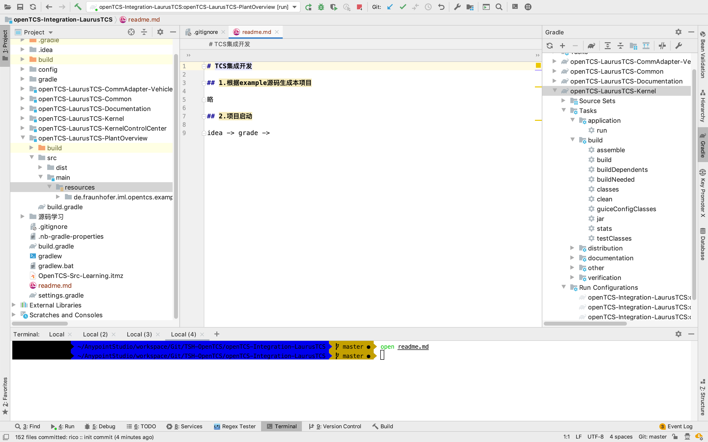
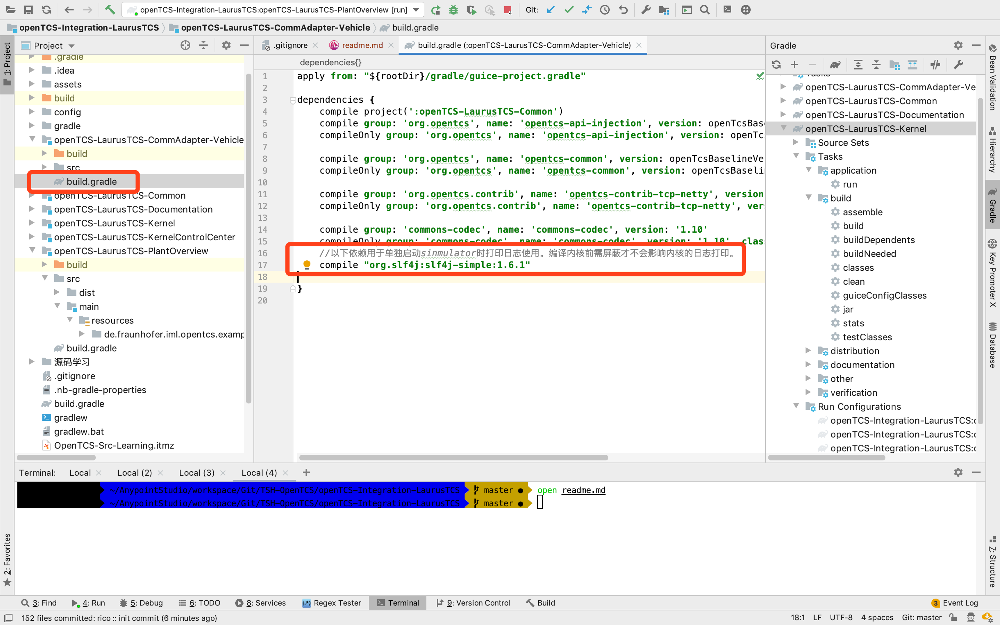
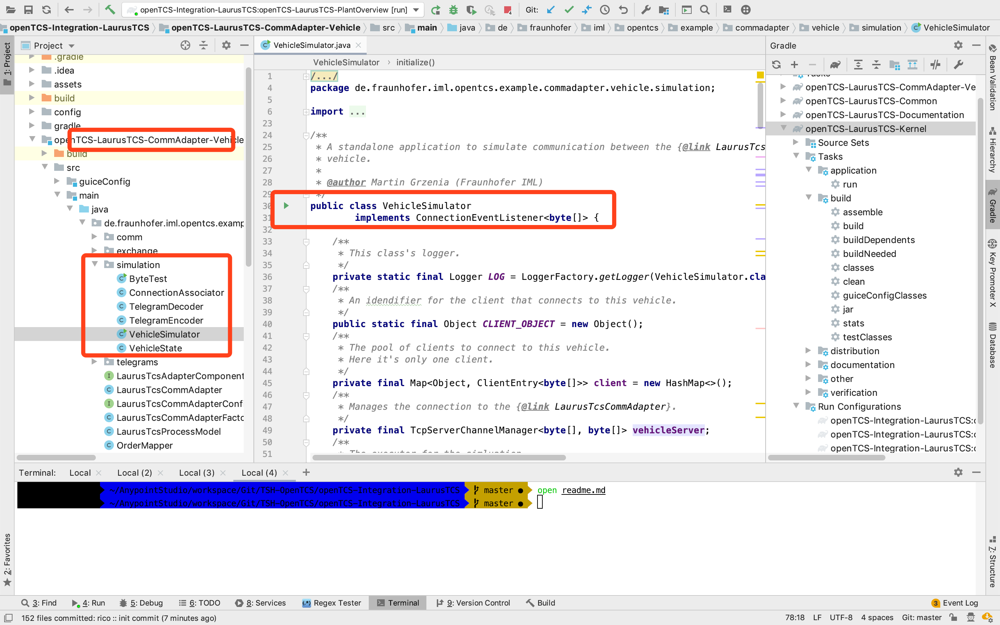
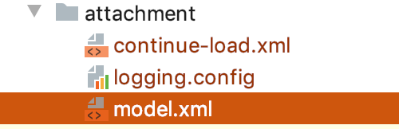

# TCS集成开发

## 1.根据example源码生成本项目

略

## 2.项目启动

idea -> grade -> kernel -> task ->run

同样方式启动plant-view

## 3.启动模拟器

### 3.1.调整gradle依赖,以支持模拟器日志打印

### 3.2.启动模拟器

## 4.开始TCS正常调试

本项目根目录下`attachment`附带了一些模型附件及相关配置

