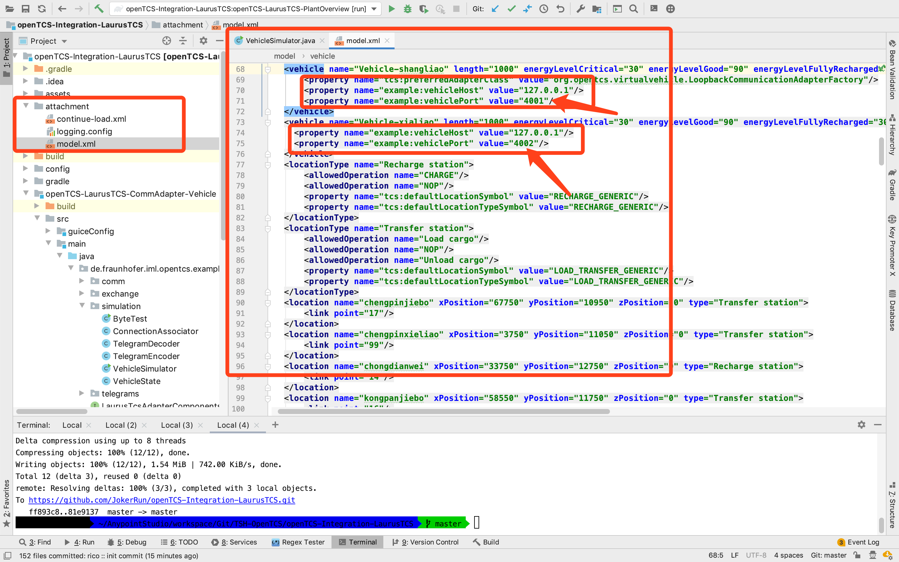
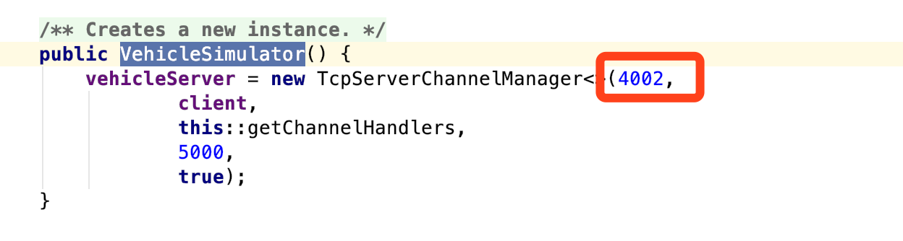

# TCS集成开发

## 1.根据example源码生成本项目

略

## 2.项目启动

idea -> grade -> kernel -> task ->run


同样方式启动plant-view

## 3.启动模拟器

### 3.1.调整gradle依赖,以支持模拟器日志打印


### 3.2.启动模拟器


多辆小车可以根据model中配置的小车端口来调整`de.fraunhofer.iml.opentcs.example.commadapter.vehicle.simulation.VehicleSimulator#VehicleSimulator`方法下的端口号,以模拟多辆不同小车.







## 4.开始TCS正常调试

本项目根目录下`attachment`附带了一些模型附件及相关配置


## 5.模拟器修改说明

`de.fraunhofer.iml.opentcs.example.commadapter.vehicle.simulation.VehicleSimulator#onIncomingTelegram`方法中添加日志打印,及遇到订单请求时,新增任务执行`simulateCompleteTask`.

```java
    @Override
    public void onIncomingTelegram(byte[] request) {
        if (request[2] == StateRequest.TYPE) {
            //            LOG.info("Incoming StateRequest : {}", request);
            int telegramCounter = Ints.fromBytes((byte) 0, (byte) 0, request[3], request[4]);
            //            LOG.info("小车收到TCS发来【状态报文】,报文ID:telegramCounter={}", telegramCounter);
            vehicleState.setTelegramCounter(telegramCounter);
            byte[] response = createStateResponse();
            //            LOG.info("Sending StateRequest response: {}", response);
            LOG.info("小车返回当前状态：id={},pos.id={},opstate={},loadstate={},lastReceivedOrderId={},currentOrderId={},lastFinishedOrderId={}",
                    Ints.fromBytes((byte) 0, (byte) 0, response[3], response[4]),
                    Ints.fromBytes((byte) 0, (byte) 0, response[5], response[6]),
                    (char) response[7],
                    (char) response[8],
                    Ints.fromBytes((byte) 0, (byte) 0, response[9], response[10]),
                    Ints.fromBytes((byte) 0, (byte) 0, response[11], response[12]),
                    Ints.fromBytes((byte) 0, (byte) 0, response[13], response[14]),
                    response);
            vehicleServer.send(CLIENT_OBJECT, response);
        } else if (request[2] == OrderRequest.TYPE) {
            LOG.info("Incoming OrderRequest : {}", request);
            int telegramCounter = Ints.fromBytes((byte) 0, (byte) 0, request[3], request[4]);
            LOG.info("小车收到TCS发来【订单报文】报文,id={},orderId={},destId={},destAction={}",
                    Ints.fromBytes((byte) 0, (byte) 0, request[3], request[4]),
                    Ints.fromBytes((byte) 0, (byte) 0, request[5], request[6]),
                    Ints.fromBytes((byte) 0, (byte) 0, request[7], request[8]),
                    (char) request[9]
            );

            vehicleState.setTelegramCounter(telegramCounter);
            int orderID = Ints.fromBytes((byte) 0, (byte) 0, request[5], request[6]);
            vehicleState.setLastReceivedOrderId(orderID);

            simulateCompleteTask(request);

            byte[] response = createOrderResponse();
            LOG.info("小车响应订单接受情况：id={},orderId={}",
                    Ints.fromBytes((byte) 0, (byte) 0, response[3], response[4]),
                    Ints.fromBytes((byte) 0, (byte) 0, response[5], response[6])
            );
            LOG.info("Sending OrderRequest response: {}", response);
            vehicleServer.send(CLIENT_OBJECT, response);
        }
    }

```


`de.fraunhofer.iml.opentcs.example.commadapter.vehicle.simulation.VehicleSimulator#simulateCompleteTask`

```java

    /**
     * 模拟小车执行tcs下发的订单任务
     *
     * @author Rico
     * @date 2020/2/5 2:25 下午
     */
    private void simulateCompleteTask(byte[] request) {
        int requestId = Ints.fromBytes((byte) 0, (byte) 0, request[3], request[4]);
        int orderID = Ints.fromBytes((byte) 0, (byte) 0, request[5], request[6]);
        int destId = Ints.fromBytes((byte) 0, (byte) 0, request[7], request[8]);
        char destAction = (char) request[9];
        if (vehicleState.getOperationMode() == 'I') {
            vehicleState.setCurrOrderId(orderID);
            //执行移动: 更改小车运行状态为移动中 --> 更新小车当前点位 --> 更改小车运行状态为空闲(完成移动)
            if (vehicleState.getCurrOrderId() != destId) {
                taskExecutor.schedule(setOperationState('M'), 0, TimeUnit.SECONDS);
                taskExecutor.schedule(setPositionId(destId), 1, TimeUnit.SECONDS);
            }
            if ('N' == destAction) {
                taskExecutor.schedule(setOperationState('I'), 1, TimeUnit.SECONDS);
            } else if ('L' == destAction) {
                taskExecutor.schedule(setOperationState('A'), 1, TimeUnit.SECONDS);
                taskExecutor.schedule(setLoadState('F'), 2, TimeUnit.SECONDS);
                taskExecutor.schedule(setOperationState('I'), 2, TimeUnit.SECONDS);
            } else if ('U' == destAction) {
                taskExecutor.schedule(setOperationState('A'), 1, TimeUnit.SECONDS);
                taskExecutor.schedule(setLoadState('E'), 2, TimeUnit.SECONDS);
                taskExecutor.schedule(setOperationState('I'), 2, TimeUnit.SECONDS);
            }
            taskExecutor.schedule(setLastFinished(orderID), 2, TimeUnit.SECONDS);

        }

```

